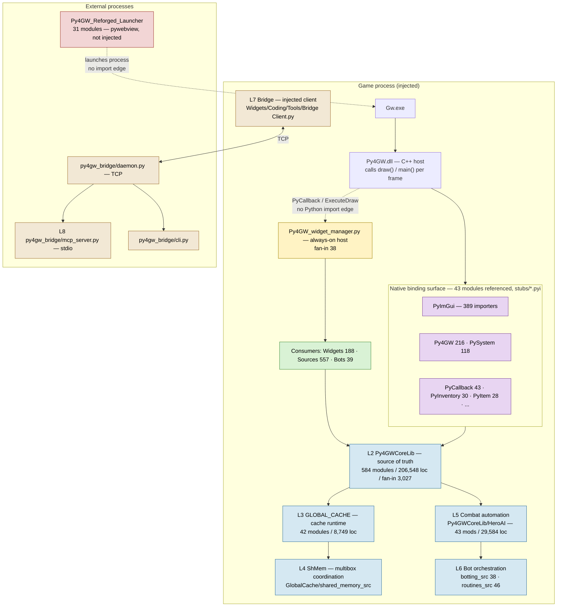
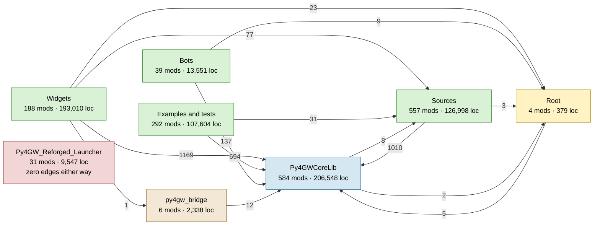
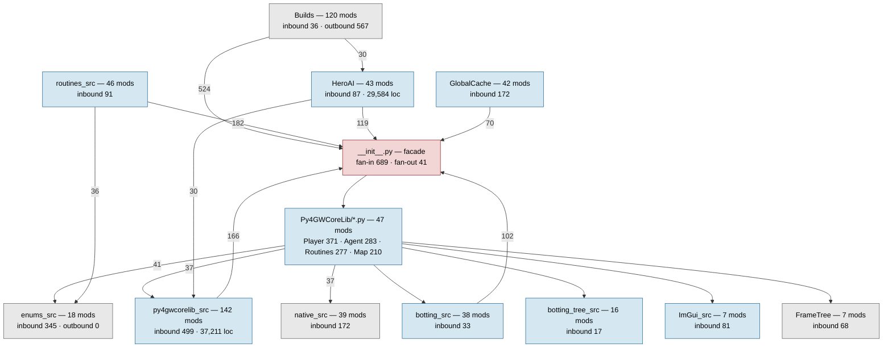
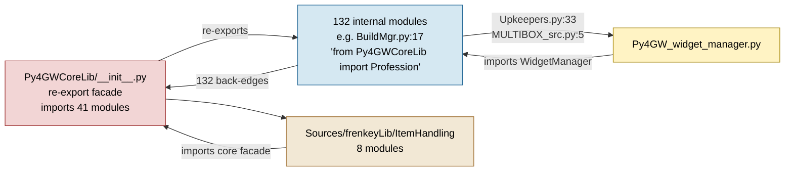

# Dependency Map

Status: current — all figures generated by [tools/build_graph.py](tools/build_graph.py) into
[graph.json](graph.json) on 2026-09-05 against clean `main` at `8dfdcaf2`.
Regenerate: `python docs/architecture/refactor-baseline/tools/build_graph.py`

Totals: **1,701 modules**, **659,975 lines**, **6,929 import edges**, **47 namespaces**,
**8 areas**, **12 cycles**, **0 self-loops**, **1 unparseable file**.

Edges are counted once per `(source, target)` pair. A `from X import A, B, C` is one edge,
not three.

## Layer stack and runtime boundaries

The layer definitions are owned by
[py4-gw-conceptual-model.md](../reference/py4-gw-conceptual-model.md). This section adds
only what the graph measures: where the boundaries fall in the file tree, and where code
crosses them.



Three boundaries are crossed without a Python import edge, and the graph cannot see any of
them. They are the source of most of the Known Unknowns below:

1. **C++ → Python.** The DLL invokes `draw()`/`main()` per frame and runs widget callbacks.
2. **Widget host → widget.** `os.walk` + `spec_from_file_location`, gated on a `.widget`
   marker file.
3. **Launcher → game.** A separate process; it starts `Gw.exe` and injects the DLL.

The launcher is the only component where web assumptions legitimately apply — it is a
`pywebview` shell running outside the client. Everything else is immediate-mode ImGui
inside the game process.

### Native boundary crossings

43 of the 45 declared binding modules are referenced, by importing module:

| Binding | Importers | Binding | Importers | Binding | Importers |
|---|---|---|---|---|---|
| `PyImGui` | 389 | `PyUIManager` | 22 | `PyAgent` | 9 |
| `Py4GW` | 216 | `PyOverlay` | 20 | `PyDialog` | 8 |
| `PySystem` | 118 | `PyGameThread` | 13 | `PySkillbar` | 8 |
| `PyCallback` | 43 | `PyParty` | 11 | `PyEffects` | 7 |
| `PyInventory` | 30 | `PyPing` | 10 | `PySkill` | 7 |
| `PyItem` | 28 | | | | |

By area: `Py4GWCoreLib` 295, `Widgets` 285, `Examples and tests` 224, `Sources` 197,
`Bots` 13, `Py4GW_Reforged_Launcher` 5, root 4, `py4gw_bridge` 2.

**Finding — verified.** The conceptual model states that `PyImGui` is the low-level
primitive and that `ImGui_Legacy`, `Overlay`, `DXOverlay` and `UIManager` are the
project-facing layer built on it. Measured, the project-facing layer is routinely
bypassed: `Py4GWCoreLib/ImGui_src/` receives 81 cross-namespace edges, while `PyImGui` is
imported directly by 389 modules across every area. The stated layering is a convention,
not an enforced boundary, and it is not recorded in the model's Known Unknowns.

## Area-level dependency graph



`Py4GW_Reforged_Launcher` has **zero** edges in either direction. It is the only fully
decoupled component in the repository.

Two edge groups run against the intended direction and are analysed below:
`Py4GWCoreLib → Sources` (8) and `Py4GWCoreLib → Root` (2).

### Fan-in / fan-out by area

| Area | Modules | Lines | Internal edges | Outbound | Inbound | Zero fan-in | Parse errors |
|---|---|---|---|---|---|---|---|
| `Py4GWCoreLib` | 584 | 206,548 | 2,968 | 10 | 3,027 | 55 | 0 |
| `Sources` | 557 | 126,998 | 627 | 1,013 | 118 | 353 | 0 |
| `Examples and tests` | 292 | 107,604 | 57 | 727 | 0 | 268 | 1 |
| `Widgets` | 188 | 193,010 | 13 | 1,270 | 2 | 181 | 0 |
| `Bots` | 39 | 13,551 | 29 | 147 | 0 | 27 | 0 |
| `Py4GW_Reforged_Launcher` | 31 | 9,547 | 44 | 0 | 0 | 10 | 0 |
| `py4gw_bridge` | 6 | 2,338 | 5 | 12 | 1 | 4 | 0 |
| Root | 4 | 379 | 0 | 7 | 38 | 3 | 0 |

`Widgets` has **13 internal edges across 188 modules and 193k lines**. Widgets do not
compose with each other; each is an independent leaf talking straight to the core. The
same holds for `Examples and tests` (57 internal edges across 292 modules), where most of
those 57 are inside two self-contained legacy packages.

## Py4GWCoreLib internal structure



`enums_src` is the model citizen: 345 inbound cross-namespace edges, **zero** outbound. It
is a pure leaf and can be depended on safely from anywhere.

### The public-contract shim layer

Six files in `Py4GWCoreLib/` are thin re-export facades over the `*_src` implementation
packages. They are the names consumers actually depend on, which makes them the most
contract-sensitive files in the repository relative to their size:

| Shim | Lines | Fan-in | Fronts |
|---|---|---|---|
| `Routines.py` | 29 | 277 | `routines_src/` |
| `ImGui.py` | 19 | 194 | `ImGui_src/` |
| `enums.py` | 289 | 187 | `enums_src/` |
| `Botting.py` | 362 | 111 | `botting_src/` |
| `Py4GWcorelib.py` | 36 | 100 | `py4gwcorelib_src/` |
| `Database.py` | 8 | — | `database_src/` |

This is deliberate and sound design. It is *not* the cause of the cycle below; the package
`__init__.py` re-exporting the same surface, and internal modules importing back through
it, is.

### Fan-in leaders (top 20, whole repository)

| Fan-in | Module | Fan-in | Module |
|---|---|---|---|
| 689 | `Py4GWCoreLib/__init__.py` | 107 | `Py4GWCoreLib/GlobalCache/__init__.py` |
| 371 | `Py4GWCoreLib/Player.py` | 101 | `Py4GWCoreLib/UIManager.py` |
| 283 | `Py4GWCoreLib/Agent.py` | 100 | `Py4GWCoreLib/Py4GWcorelib.py` |
| 277 | `Py4GWCoreLib/Routines.py` | 96 | `Py4GWCoreLib/Item.py` |
| 210 | `Py4GWCoreLib/Map.py` | 87 | `Py4GWCoreLib/enums_src/GameData_enums.py` |
| 194 | `Py4GWCoreLib/ImGui.py` | 86 | `Py4GWCoreLib/Skill.py` |
| 187 | `Py4GWCoreLib/enums.py` | 74 | `Py4GWCoreLib/py4gwcorelib_src/BehaviorTree.py` |
| 127 | `Py4GWCoreLib/py4gwcorelib_src/Settings.py` | 67 | `Py4GWCoreLib/FrameTree/__init__.py` |
| 123 | `Py4GWCoreLib/BuildMgr.py` | 63 | `Py4GWCoreLib/enums_src/Item_enums.py` |
| 120 | `Py4GWCoreLib/AgentArray.py` | 62 | `Py4GWCoreLib/enums_src/Model_enums.py` |

Every module in the top 20 belongs to `Py4GWCoreLib`. No `Widgets/`, `Sources/` or `Bots/`
module is a dependency hub for anything else — the consumer areas are genuinely leaves.

### Fan-out leaders (top 12)

| Fan-out | Module | Lines | Fan-in |
|---|---|---|---|
| 45 | `Sources/ApoSource/py4gw_demo_src/registry.py` | 224 | 1 |
| 43 | `Sources/frenkeyLib/ItemManager/ui.py` | 8,127 | 1 |
| 41 | `Py4GWCoreLib/__init__.py` | 211 | 689 |
| 38 | `Py4GWCoreLib/HeroAI/ui.py` | 2,948 | 5 |
| 30 | `Py4GWCoreLib/py4gwcorelib_src/system_settings/config_ui.py` | 319 | 1 |
| 30 | `Sources/frenkeyLib/LootEx/gui.py` | 6,126 | 0 |
| 28 | `Examples and tests/.../InventoryPlus.py` | 3,139 | 0 |
| 28 | `Examples and tests/tests/context_diagnostic.py` | 1,010 | 0 |
| 26 | `Py4GWCoreLib/routines_src/Yield.py` | 676 | 7 |
| 26 | `Widgets/Automation/Bots/Missions/Core/Underworld.py` | 3,237 | 0 |
| 25 | `Py4GWCoreLib/Botting.py` | 362 | 111 |
| 25 | `Py4GWCoreLib/HeroAI/ui_base.py` | 2,528 | 6 |

## Cycles

12 strongly connected components, 0 self-loops. One dominates everything else.

### Cycle 1 — the core facade cycle (323 modules)

**This is the single most consequential structural fact in the repository.**

323 modules — 19% of all in-scope Python — form one strongly connected component,
spanning eleven core namespaces plus eight `Sources/frenkeyLib/ItemHandling` modules and
the root widget host.

| Namespace | Members in cycle |
|---|---|
| `Py4GWCoreLib/py4gwcorelib_src` | 74 |
| `Py4GWCoreLib/Builds` | 72 |
| `Py4GWCoreLib/botting_src` | 37 |
| `Py4GWCoreLib/HeroAI` | 37 |
| `Py4GWCoreLib/routines_src` | 32 |
| `Py4GWCoreLib/GlobalCache` | 30 |
| `Py4GWCoreLib` (top level) | 24 |
| **`Sources/frenkeyLib/ItemHandling`** | **8** |
| `Py4GWCoreLib/ImGui_src` | 4 |
| `Py4GWCoreLib/FrameTree` | 2 |
| `Py4GWCoreLib/native_src` | 2 |
| **Root (`Py4GW_widget_manager.py`)** | **1** |

**Mechanism — verified.** `Py4GWCoreLib/__init__.py` is a re-export facade importing 41
modules. **132 of the cycle's members import back through that facade** rather than
importing a sibling directly.



Representative back-edge, verified at source —
[`Py4GWCoreLib/BuildMgr.py:17`](../../../Py4GWCoreLib/BuildMgr.py#L17):

```python
from Py4GWCoreLib import Profession
```

`BuildMgr.py` is itself re-exported by `__init__.py`. Every such line closes the loop.

**Consequences for the refactor:**

- No core namespace can be extracted while the facade back-edges exist. Cutting `HeroAI`,
  `Builds`, `routines_src` or `GlobalCache` out of the cycle means first repointing 132
  import statements from the package root to siblings.
- `Builds` alone contributes **524** of those back-edges — the largest single source, and
  120 modules of game content rather than infrastructure.
- `Sources/frenkeyLib/ItemHandling` is not merely imported *by* core (PF-3's claim) — it is
  *inside* the core's strongly connected component. It cannot be moved, retired or migrated
  independently of `Py4GWCoreLib`.
- The facade has import-time side effects: `Py4GWCoreLib/__init__.py:17` shells out to
  `where python` via `subprocess.check_output`, mutates `sys.path`, then imports the native
  binding modules. This is why `Examples and tests/tests/` loads its subjects with
  `spec_from_file_location` instead of importing them — the package cannot be imported
  outside the injected client. **The cycle is also a testability barrier**, and the entire
  test suite is shaped around working past it.

### Cycles 2–12

| # | Size | Members | Note |
|---|---|---|---|
| 2 | 18 | `Sources/frenkeyLib/LootEx/*` | Entirely inside a subsystem with zero external importers |
| 3 | 6 | `Sources/frenkeyLib/global_configs/*` | Config classes mutually referential |
| 4 | 5 | `Py4GWCoreLib/py4gwcorelib_src/map_overlay/*` | `__init__` ↔ `agents`/`config_ui`/`host`/`interaction` |
| 5 | 4 | `Bots/Example Bots/YAVB/*` | `FSMHelpers` ↔ `GUI` ↔ `YAVBMain` ↔ `LogConsole` |
| 6 | 3 | `Py4GWCoreLib/BottingTree.py` ↔ `botting_tree_src/{config,ui}` | Facade pattern, small scale |
| 7 | 3 | `py4gwcorelib_src/system_settings/camera_smoothing/*` | `__init__` ↔ `controller` ↔ `persistence` |
| 8 | 3 | `Py4GW_Reforged_Launcher/launcher_core/{mod_repo,mod_root,settings_store}` | Only cycle in the launcher |
| 9 | 3 | `Sources/frenkeyLib/item_mods_src/{properties,upgrade_parser,upgrades}` | |
| 10 | 2 | `native_src/context/TextContext.py` ↔ `internals/string_table.py` | |
| 11 | 2 | `frenkeyLib/DataCollector/collectors/items_collector.py` ↔ `item_data/item_snapshot.py` | |
| 12 | 2 | `Sources/frenkeyLib/MultiBoxing/{messaging,settings}` | |

Cycles 4, 6 and 7 are the same small pattern as cycle 1 — a package `__init__` re-exports
its own submodules, which import the package back. They are individually cheap to break and
are useful rehearsals for the large one.

## Orphans and single-consumer modules

| Measure | Count | Share |
|---|---|---|
| Zero fan-in (nothing imports it) | 901 | 53.0% |
| Zero fan-in from outside its own namespace | 1,331 | 78.2% |
| Exactly one consumer | 369 | 21.7% |

**These numbers must not be read as dead code.** See the reachability rule in
[README.md](README.md#the-reachability-rule--read-before-acting-on-any-zero-fan-in-row).

Zero fan-in by area, with the interpretation the graph supports:

| Area | Zero fan-in / total | What zero fan-in means here |
|---|---|---|
| `Widgets` | 181 / 188 | Expected. Runtime-discovered entry points. |
| `Bots` | 27 / 39 | Expected. Path-launched entry points. |
| `Sources` | 353 / 557 | Mixed — includes 283 Python-as-data modules (below). |
| `Examples and tests` | 268 / 292 | Mixed — entry points, plus a genuine graveyard. |
| `Py4GWCoreLib` | 55 / 584 | **Meaningful.** Core modules are libraries; unreachable is a defect. |
| `Py4GW_Reforged_Launcher` | 10 / 31 | Expected — 8 are `test_*.py`, 2 are entry points. |
| `py4gw_bridge` | 4 / 6 | Expected — `daemon`, `cli`, `mcp_server` are `python -m` entry points. |

### Namespaces with zero external consumers

| Namespace | Modules | Lines | Reading |
|---|---|---|---|
| `Examples and tests/Legacy code and tests` | 162 | 66,534 | Graveyard — verified |
| `Widgets/Guild Wars` | 13 | 48,419 | Expected — widgets are leaves |
| `Examples and tests` (root) | 59 | 10,626 | Examples are entry points |
| `Py4GW_Reforged_Launcher` | 31 | 9,547 | Correct — separate process |
| `Bots/Example Bots` | 16 | 7,942 | Expected — entry points |
| `Widgets/WidgetCatalog` | 1 | 2,875 | Unreachable — no `.widget` marker |
| `Sources/ZaishenBounty` | 35 | 1,547 | **Live** — path-loaded, see below |
| `Bots/{Halloween,Elite Tome,Ewoog,Challenge Missions}` | 9 | 1,409 | Expected — entry points |
| `Sources/oazix` | 3 | 292 | **Broken** — cannot import, see below |
| `Py4GWCoreLib/tests` | 1 | 241 | Stray test inside the library |

`Sources/ZaishenBounty` and `Sources/oazix` have **identical graph signatures** — zero
fan-in, zero external consumers — and came out opposite ways on inspection. That pair is
the whole argument for not reading the fan-in column as a kill list.

### Widget reachability is decidable — but not from imports

`WidgetManager._scan_widget_folders`
([WidgetManager.py:891](../../../Py4GWCoreLib/py4gwcorelib_src/WidgetManager.py#L891))
loads `.py` files **only from directories containing a `.widget` marker file**:

```python
for current_dir, dirs, files in os.walk(self.widgets_path):
    if ".widget" in files:
        for py_file in [f for f in files if f.endswith(".py")]:
            self._load_widget_module(current_dir, py_file)
```

57 marker directories exist. This gives a second, decisive reachability test that the
import graph does not contain: a widget module in an unmarked directory **and** with zero
fan-in is unreachable by both mechanisms. Two components meet that bar and are the only
`Remove`-on-reachability verdicts in the register —
`Widgets/WidgetCatalog/` and
`Widgets/Automation/Bots/Farmers/Trophies/Nicholas the Traveler/`.

A marker makes a module *discoverable*, not *enabled*. Enabled state is per-account
`Settings` data written at runtime, so which widgets any user actually runs remains a Known
Unknown.

## Broken in-repo imports

19 import statements name a module inside this repository that does not exist. Each was
verified by hand. Implicit namespace packages are not counted.

| Location | Missing target | Note |
|---|---|---|
| `Py4GWCoreLib/botting_src/subclases_src/INTERACT_src.py:156` | `Widgets.Blessed` | **In the core library** — see below |
| `Widgets/Automation/Multiboxing/HeroAi Skill Editor.py:474,480,514` | `HeroAI.custom_skill`, `.custom_skill_src.skill_types`, `.combat` | Root `HeroAI/` no longer exists; wrapped in `except Exception: pass` |
| `Sources/oazix/areas/{azura_reputation,planter_fiber,stone_carving}.py:4` | `Bots.oasix.areas.simple_bot_4_steps` | Spelling `oasix` vs directory `oazix`; neither exists |
| `Sources/frenkeyLib/Drafts/Py4GW Library.py:20,22` | `Sources.frenkeyLib.Py4GWLibrary.enum`, `.module_cards` | In `Drafts/`, zero importers |
| `Examples and tests/.../NEW_Py4GW_widget_manager.py:1,3` | `Widgets.widget_manager.main` | Superseded widget-manager copy |
| `Examples and tests/.../Py4GW_widget_managerREWORK.py:6` | `Py4GWCoreLib.IniManager` | Now `py4gwcorelib_src/Settings.py` |
| `Examples and tests/tests/test_sqlite3.py:15` | `Py4GWCoreLib.DBMgr` | Now `database_src/DBMgr.py` |

### The one that matters: a broken import inside the core library

`Py4GWCoreLib/botting_src/subclases_src/INTERACT_src.py:156` does
`from Widgets.Blessed import Get_Blessed` inside `_coro_get_blessing`. `Widgets/Blessed.py`
does not exist anywhere in the tree (deleted in `3a1d424f`, "Reworking Widget system").

Because the import is function-level, nothing static flags it and module load succeeds. It
raises only when the coroutine runs. The affected surface is public and reachable across
accounts:

- `Botting.Interact.GetBlessing()` — decorated `@_yield_step("GetBlessing",
  "INTERACT_GET_BLESSING")` at `:219`, so it is a documented Botting step.
- `SharedCommandType.GetBlessing` exists in `enums_src/Multiboxing_enums.py:10`, and
  `Sources/ApoSource/ApoBottingLib/helpers.py:431` sends it cross-account.

This is also **the only static `Py4GWCoreLib → Widgets` edge in the repository**, and it is
broken. It is the receipt for why core must not import widgets. It is not covered by
PF-1…PF-5.

Blessing is in fact implemented three times: this broken core step, an independent
self-contained handler at `Widgets/System/Messaging.py:1257` (used for the cross-account
command), and `Sources/aC_Scripts/aC_api/Blessing_Core.py:98` (`BlessingRunner`). The copy
in the core library — the one with the most authoritative name — is the one that cannot
run.

One further file does not parse at all:
`Examples and tests/Legacy code and tests/Misc/results_log.py` (`unexpected indent`, line 1).

## Dynamic dispatch — where the graph goes blind

86 sites where control flow leaves the static import graph.

| Kind | Count | Meaning |
|---|---|---|
| `path-loader` | 56 | `spec_from_file_location` / `module_from_spec` |
| `sys-path-mutation` | 13 | `sys.path.append/insert` |
| `exec` | 10 | `exec()` / `eval()` |
| `importlib-dynamic` | 7 | `import_module()` with a non-literal argument |

Partly offsetting these, the generator recovers **121 `string-ref` edges**: string literals
that exactly name a real in-repo module and are later fed to a dynamic import. The clearest
case is the System Settings dispatch table at
`Py4GWCoreLib/py4gwcorelib_src/system_settings/config_ui.py:257`:

```python
("Salvage", "Py4GWCoreLib.py4gwcorelib_src.system_settings.salvage.config_ui"),
```

Without that recovery, `salvage/config_ui.py` (727 loc) reads as unreachable. With it, it
correctly shows fan-in 1. String references resolve **only** on an exact module-path match;
the leaf and sibling heuristics are refused for them, because any bare word matching a
filename would otherwise manufacture an edge.

The 56 path-loader sites split into three populations:

- **The widget host** — `WidgetManager.py:390`, the reason 181 widgets show zero fan-in.
- **The test suite** — `Examples and tests/tests/` loads its subjects by path to avoid
  importing `Py4GWCoreLib`. These are real consumer relationships absent from the graph.
  Verified targets: `system_settings/loot_filter_factory` (4 tests),
  `Sources/frenkeyLib/ItemHandling/UIManagerExtensions.py` (3), `Py4GWCoreLib/Inventory.py`
  (3), `system_settings/salvage` (2), `py4gwcorelib_src/inventory_transfer.py`,
  `system_settings/item_runtime.py`, `routines_src/behaviourtrees_src/path_following.py`,
  `Widgets/Automation/Bots/SkillsUnlocker`.
- **Python-as-data loaders** — below.

### Python-as-data: a coupling class with no import edge and no schema

A substantial body of "data" is stored as **Python modules loaded by path, whose
module-level variable names are derived from the filename**. This is neither an import
relationship nor a data-file relationship, so it appears in neither half of this analysis
unless called out.

`Widgets/Automation/Bots/Missions/Zaishen_Bounty.py` is the clearest case:

```python
:10   BOUNTIES_DIR = os.path.join(projects_base_path, "Sources", "ZaishenBounty")
:562  bounties = sorted([f[:-3] for f in os.listdir(BOUNTIES_DIR) if f.endswith(".py")])
:523  spec = importlib.util.spec_from_file_location(bounty_name, bounty_file)
:528  ids           = getattr(mod, f"{bounty_name}_ids", {})
:531  outpost_path  = getattr(mod, f"{bounty_name}_outpost_path", [])
:532  bounty_path   = getattr(mod, bounty_name, [])
```

The directory listing populates a combo box; the filename then *becomes* the variable name
the loader reads back.

| Data set | Modules | Loader | Contract |
|---|---|---|---|
| `Sources/aC_Scripts/PyQuishAI_maps` | 142 | `PyQuishAI.py:355` | filename selected from `MAPS_DIR` listing |
| `Sources/aC_Scripts/OutpostRunner/maps` | 106 | `map_loader.py:84` | `maps/<region>/<run>.py` attribute lookup |
| `Sources/ZaishenBounty` | 35 | `Zaishen_Bounty.py:523` | `<Name>`, `<Name>_ids`, `<Name>_outpost_path` |

That is **283 modules — 17% of all in-scope Python** — whose contract is a filename plus a
naming convention, enforced by nothing.

Failure behaviour differs between the loaders, and the difference matters:

- `Zaishen_Bounty.py:528-532` reads via `getattr(mod, f"{name}_ids", {})`. A rename **fails
  silently** — the default is returned and the route comes back empty.
- `map_loader.py:82` raises `FileNotFoundError` on a missing file, so that one fails loudly.

These modules show zero fan-in in every tool anyone points at this repository, and a bulk
rename or directory reorganisation breaks at least the `getattr`-style consumers without
producing a single error. They are data wearing a `.py` extension.

## Data-file coupling

The mechanical result is itself the finding.

**Rooted path literals into `json/`, `Settings/`, `data/`, `offsets/`: 6.** All six are
docstrings or help text, not file access. Code here essentially never names a data path
directly.

Coupling is expressed instead as a **logical document name** handed to an owning
persistence class:

| Owner | Call sites |
|---|---|
| `Settings(...)` | 280 |
| `JsonFactory(...)` | 61 |
| `IniManager(...)` | 19 |
| `IniHandler(...)` / `get_settings(...)` | 2 |

46 distinct logical documents are statically detectable (literal first argument) — e.g.
`JsonFactory:Widgets/LayoutManager/window_layouts.json`,
`Settings:HeroAI/FollowModule_Formations.ini`,
`Settings:Inventory/XunlaiManager/xunlai_manager.ini`. The rest are computed at runtime from
account identity or profile state. The jail resolves inside `JsonFactory`/`Settings`
(`json/<account-email>/...`), not at the call sites, so the call sites carry no path
evidence.

**Data coupling therefore cannot be fully derived from source.** The figures above are a
floor, not a total, and this is recorded as a Known Unknown rather than estimated.

### Raw file I/O — the bypass surface

641 sites call `open`, `json.load/dump`, `makedirs`, `read_text`/`write_text` directly,
bypassing the owning persistence classes.

| Namespace | Raw I/O sites | Assessment |
|---|---|---|
| `Sources/frenkeyLib` | 135 | Bypass — PF-3 already records this defect class |
| `Examples and tests/Legacy code and tests` | 118 | Bypass, but in the graveyard |
| `Py4GW_Reforged_Launcher` | 103 | **Legitimate** — separate process, outside the jail |
| `Widgets/Automation` | 41 | Bypass — needs per-widget review |
| `Sources/modular_data` | 38 | Bypass — mostly offline test fixtures |
| `Py4GWCoreLib/py4gwcorelib_src` | 37 | Bypass inside the owner's own area |
| `Examples and tests/tests` | 35 | Mostly legitimate — tests build fixtures |

The launcher's 103 sites are correct and must not be flagged: it runs outside the injected
client and has no access to the jailed persistence layer. Counting it as a defect would be
exactly the context-free rule the autopsy warns against.

## Empty directory husks

24 directories under code paths contain no files at any depth. Git does not track empty
directories, so these exist only in working copies — they are leftovers from moves that
did not clean up, and they actively mislead readers about where code lives.

| Husk | Where the code actually is |
|---|---|
| `HeroAI/`, `HeroAI/{custom_skill_src,follow,hex_removal_src}` | `Py4GWCoreLib/HeroAI/` |
| `BridgeRuntime/` | Nothing — removed in `65107cd4` |
| `Py4GWCoreLib/py4gwcorelib_src/{agent_recolor,beacons,camera_smoothing,item_catalog,loot_filter_factory,loot_filters,map_utilities,name_obfuscation,recolor_beacons,skillbar_plus,title_on_map_load,window_renamer}` (12) | `py4gwcorelib_src/system_settings/<same name>/` |
| `Py4GWCoreLib/HeroAI/wells_src`, `system_settings/identification_filters` | Nothing |
| `Widgets/Guild Wars/{Customization,Screen Overlays,Triggers}` | Nothing |

`Widgets/WidgetManager/` and `Widgets/Config` are **not** husks — the widget host creates
`Widgets/WidgetManager` at runtime (`Py4GW_widget_manager.py:_bootstrap_once`) and writes
its INI there.

The `HeroAI/` husk is not cosmetic: `Widgets/Automation/Multiboxing/HeroAi Skill Editor.py`
tests `_CUSTOM_SKILL_SRC_DIR.exists()`, which returns **True** for the empty directory,
then finds no files — so the widget silently does nothing rather than reporting a missing
dependency.

## Reconciliation with existing records

Every point below is a place this baseline disagrees with, or materially extends, an
existing document. The current-source position is stated in each case.

### Against [py4-gw-conceptual-model.md](../reference/py4-gw-conceptual-model.md)

**1 · `HeroAI` is no longer a top-level system. — baseline is right.**
The model's Layer 5 names `HeroAI.CombatClass` alongside
`Py4GWCoreLib.SkillManager.Autocombat` as parallel combat engines. On current source the
root `HeroAI/` contains **zero files** and is absent from `git ls-tree HEAD`. The system
lives at `Py4GWCoreLib/HeroAI/` — 43 modules, 29,584 lines — and every live consumer imports
it as `Py4GWCoreLib.HeroAI.*`. The one place still using the old path
(`HeroAi Skill Editor.py:474`) is broken and silently swallowed. The layer *concept* is
sound; the location is stale.

**2 · `BridgeRuntime` does not exist. — baseline is right.**
Named in this task's scope and present as a directory, but it contains no files, is absent
from `git ls-tree HEAD`, and is referenced by no Python, Markdown, JSON or INI. There is
nothing to analyse; it is an empty husk from `65107cd4 relocating Py4Gw bridge`.

**3 · The bridge namespace map is accurate. — model is right, confirmed.**
`py4gw_bridge/injected_client.py:516-640` contains exactly the registry the model
documents, including `*_raw` → `*_corelib` preferred aliases and deprecated `*_wrapper`
compatibility aliases. The MCP adapter exposes the documented safe subset. No drift.

**4 · The ImGui layering is documented but not enforced. — new, not in the model.**
389 modules import `PyImGui` directly against 81 cross-namespace edges into
`Py4GWCoreLib/ImGui_src/`. Belongs in the model's Known Unknowns.

**5 · The core facade cycle is unrecorded. — new.**
The model's Known Unknowns note that boundaries "between some `Py4GWCoreLib` modules and
`GLOBAL_CACHE` may still overlap". The measured situation is stronger and more specific:
323 modules in one SCC through the package facade. This is the dominant constraint on any
core refactor and appears nowhere in the model.

### Against [pending-fixes.md](../records/pending-fixes.md)

The task named PF-1 through PF-4. **There are five.** PF-5 (DXOverlay 3D draw performance)
is a Native measurement problem with no Python ownership question; no verdict here touches
it.

**PF-1 (`ItemType` weapon/armour classification) — no contradiction.**
`enums_src/Item_enums.py` has fan-in 63. The register's verdict for `enums_src` is `Keep`,
which is compatible: PF-1 is a semantic defect inside a module whose *ownership* is
correct. Nothing here proposes moving or splitting it, and resolving PF-1 remains a
game-semantics call. One extension: PF-1 names `Sources/marks_sources/mods_parser.py:57,73`
as a fourth and fifth definition; that file imports `ItemType` from the core module at
`:16` while re-declaring the sets, so the fix is a one-line import change, not a redesign.

**PF-2 (Merchant Rules monolith) — substance confirmed, measurements stale.**

| PF-2 states | Current source |
|---|---|
| 30,119 lines | **38,718 lines** (+8,599) |
| class spans `:4712`–`:30088` | class starts `:6545`, 946 methods |
| `PROFILE_VERSION = 32` | **`PROFILE_VERSION = 36`** (+4 migrations) |
| "nothing imports it" | Confirmed — fan-in 0 |

PF-2's analysis holds; the file has grown ~29% since 2026-07-26 and taken four further
schema migrations. The problem is actively worsening, which matters for sequencing.

**PF-3 (frenkeyLib severance) — core claim confirmed, scope understated.**

| PF-3 states | Current source |
|---|---|
| `Sources/frenkeyLib/` is 30,991 lines | **63,410 lines** across 129 files |
| `LootEx/` is 12,336 lines, zero importers | **18,447 lines**, zero external importers — **confirmed** |
| `Py4GWLibrary/` reached only from `Drafts/` | Confirmed — 1 external importer, in `Drafts/` |
| core → frenkeyLib via `AutoInventoryHandler.py` | **Four** core files, not one |
| three parallel "decode a mod" implementations | **Four** |
| lists 9 subsystems | ~14 — `ItemManager` (8,614 loc), `item_mods_src` (12,423), `item_data`, `DataCollector`, `global_configs` are absent from PF-3's table |

The four core files importing upward into `Sources/frenkeyLib/ItemHandling/`, all verified:

| Core file | Line(s) | Target |
|---|---|---|
| `py4gwcorelib_src/AutoInventoryHandler.py` | 137, 138, 237, 347 | `Items/item_snapshot`, `Items/types`, `Rules/types`, `BTNodes` |
| `py4gwcorelib_src/system_settings/identification/controller.py` | 265 | `BTNodes` |
| `py4gwcorelib_src/system_settings/salvage/controller.py` | 156 | `Items/item_snapshot` |
| `routines_src/behaviourtrees_src/items.py` | 72, 73 | `Items/item_snapshot`, `UIManagerExtensions` |

And it is not one-way. Those eight `ItemHandling` modules are **inside the core's
323-module strongly connected component**. PF-3 describes a layering inversion; the graph
shows mutual entanglement, which is strictly harder to undo.

PF-3's path for the core mod decoder, `Py4GWCoreLib/item_mods_src`, **no longer exists**.
Core mod ownership is now `Py4GWCoreLib/mods_core.py` (495 loc, fan-in 6), `mods_types.py`
(1,231, fan-in 8) and `mods_upgrades.py` (728, fan-in 4), consumed by `Item.py` and the
Loot Filter Factory. PF-3's substance is right; the path is stale. Current parallel mod
models: core `mods_*`, `Sources/frenkeyLib/item_mods_src/` (12,423 loc),
`Sources/frenkeyLib/LootEx/models.py` (1,817), and `Sources/marks_sources/mods_parser.py`
(761) — **four**, not three.

One refinement to PF-3's framing: it describes `mods_parser.py` as "a live consumer coupled
to a dead producer's file format". The coupling is real, but the data it reads
(`Sources/marks_sources/mods_data/{runes,weapon_mods}.json`) is committed in-tree, so
MerchantRules works today regardless of whether LootEx ever runs.

**PF-4 (`agent_recolor`) — no contradiction.**
Self-contained, as PF-4 states. The register's verdict is `Improve in place`, consistent
with PF-4's "rework, not a bug fix". PF-4's constraint that existing saved uuid ids must
still load is preserved.

### Against the frenkeyLib migration records

[decision-autopsy](../records/reforged-migration/frenkeylib-decision-autopsy.md) and
[failure-and-rollback-record](../records/reforged-migration/frenkeylib-migration-failure-and-rollback-record.md)
describe a rejected migration. **No disagreement.** Their controls are treated as binding
and restated as applied constraints in
[README.md](README.md#controls-inherited-from-the-autopsy).

One reinforcement worth recording. D-03 rejects using Loot Filter Factory as a universal
profile platform because "reuse is not ownership". The graph independently supports keeping
that boundary: `loot_filter_factory` is the best-tested component in the repository — four
of the test suite's path-loaded targets are its modules — which makes it *look* like the
safest consolidation target precisely where the autopsy says consolidation was the error.
Test coverage is evidence of technical correctness, not of domain fit. The register
proposes folding no profile model into it.

## Known Unknowns

Recorded rather than inferred. Each is something the import graph cannot decide.

1. **Widget enablement.** The `.widget` marker settles *discoverability*, not whether a
   user runs a widget. Enabled state is per-account `Settings` data written at runtime.
   Every `Keep` on a widget is a statement about ownership, not usage.
2. **Bot and example reachability.** Nothing outside `Widgets/` is discovered by
   `WidgetManager`. There is no launch manifest for `Bots/` or `Examples and tests/`.
   Whether a given bot ran this year is unresolved.
3. **Chat-command registration.** Commands are registered into runtime tables, not
   imported. A handler reachable only by a chat command is invisible here.
4. **Message-router dispatch.** `Widgets/System/Messaging.py:4002` routes 67
   `SharedCommandType` cases, including `LootEx` at `:4144` — a system with zero importers.
   Whether that branch is reachable is unresolved.
5. **Native callbacks.** `PyCallback` (43 importers) and the DLL's per-frame `ExecuteDraw`
   invoke Python without an import.
6. **Full data coupling.** 46 logical documents are statically visible; the rest are
   computed at runtime from account identity or profile state. True coupling into `json/`
   and `Settings/` is larger than measured and cannot be derived from source.
7. **`offsets/` and `data/` consumers.** Zero static references to either directory, yet
   `offsets/` holds 30 files and `data/` 6. How they are loaded is unresolved — likely
   native-side or runtime-computed, but this was not confirmed.
8. ~~`Sources/ZaishenBounty` and `Sources/oazix` reachability.~~ **Resolved** — see
   *Python-as-data*. Retained as the worked example of why identical graph signatures can
   mean opposite things.
9. **`importlib.import_module` with computed arguments** — 7 sites, targets unknown by
   construction.
10. **Whether the 323-module cycle is load-bearing at runtime.** The facade's import-time
    side effects (`sys.path` mutation, native module import) may be *why* the pattern
    exists. Breaking the cycle may require preserving those effects elsewhere. Not
    investigated; must be established before any core split is designed.
11. **Live behaviour of everything above.** No injected-client run was performed for this
    baseline. Every claim is source-level. The distinction the autopsy insists on —
    offline proof versus live runtime proof — applies to this entire document.
